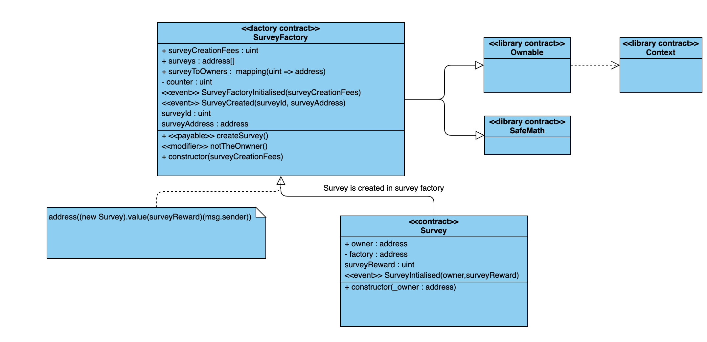

## Lab : Class Diagram

* UML class diagrams are used to represent smart contracts and `struct` datatype.
* Like a class, a smart contract can have a data structure, public and private functions, and can inherit from one or more smart contracts.
* Create a class diagram for the smart contracts related to capstone project or related to [previous](./README.md) Lab whichever is applicable.
* Submit the image on BlackBoard.
* You can use any tool of your choice to create class diagram (draw.io, Microsoft Visual Visio, Visual Paradigm etc).

### Reference:

