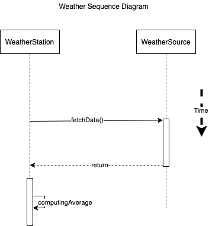

### Problem Statement

Sequence diagram is a means for designing and analyzing interactions among various software components of a blockchain application. The sequence diagram adds temporal elements to the design, which means that it lets you specify the time and the order in which functions are invoked. The vertical line in the diagram indicates timeline/progress. In figure, you see the interaction between a weather station and a data source in the field to compute the average temperature. The two classes shown are WeatherStation and WeatherSource. The sequence diagram shows the interaction and the timeline. This type of diagram is useful for explaining the sequence of operations with reference to time when a smart contract is used.

