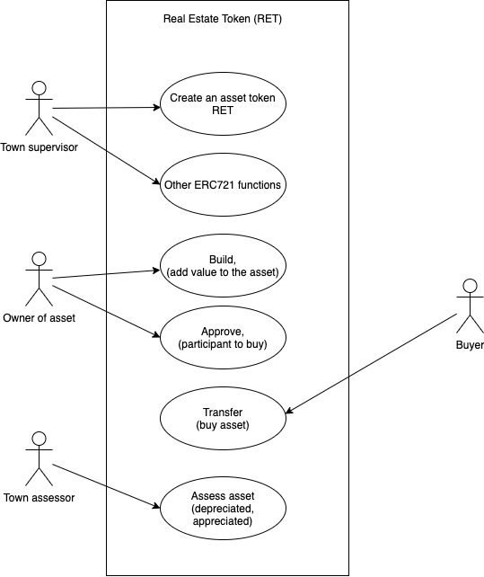

### PROBLEM STATEMENT 

Design and develop a real estate token decentralized application representing new real estate developments in a town. The town supervisor can add a piece of real estate as an asset (RET token) and at the same time assign it to an owner. This task is accomplished by the process of the creation of the RET token. (Assume that the funds for asset ownership are transferred by other means that are not within the scope of this problem.) The owner of the token can add value to the token by building on it, as well as approve a sale to a buyer, and an approved buyer can buy the asset. The real estate asset may also appreciate or depreciate as determined by a town’s assessor. For simplicity, assume that the town supervisor and the assessor have the same identity, and that they represent the town and perform operations on behalf of the town.

RET is a simplified version of the real-world real estate business.

